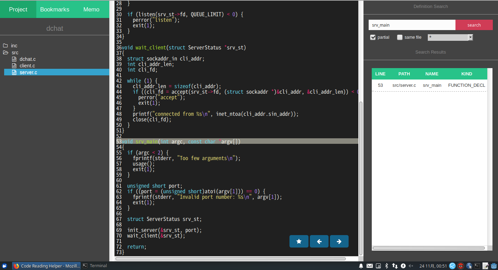

## What's this?
crh(code reading helper) is a tool that help you to read code more easily. Please notice that crh is only support C/C++ language.

## Requirements
crh is implemented in Python. I tested with Python 3 but Python 2 is also OK I think. Libraries I used are as follows.
```
bottle
pygments
peewee
```
You also need to install Python bindings of Clang and specify the path to libclang.so (LIBCLANG_PATH variables in crh.py).

## How to run this.
```
$ cd crh
$ python run.py PATH_OF_THE_PROJECT_YOU_WANT_TO_ANALYSE
```
crh will generate a database(sqlite3) file in the project directory.

## Features
- source code viewer
- definition search
- bookmark
- memo
- viewing history (back/foward button)

## Screenshot

